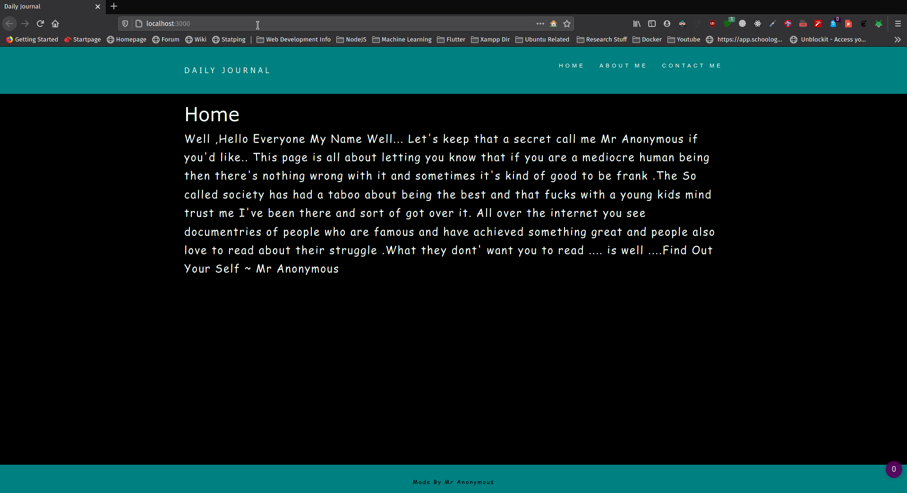
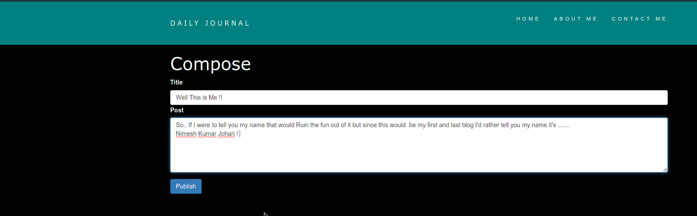
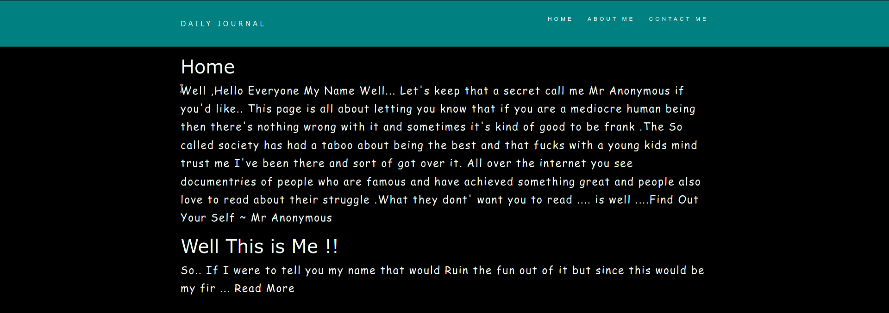
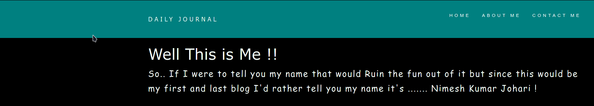

# BlogWithMongo

This is a Personal Blog Page Wherein you can write your heart Out .. 
Made By Nimesh 

Using 
# Frontend
EJS,CSS,AnimateCss,
# Backend
Node JS 

## For Installation 
make Sure You Have MongoDb Insatlled and you can run the mongod Command if the mongo db daemon is not already started .

```sh
nimesh at deathnote in /media/F/WebDev/VanillaProjects/Blog-with-Database (master …2133)
╰─λ npm install 
╰─λ mongod
╰─λ node app.js

```
#ScreenShots




